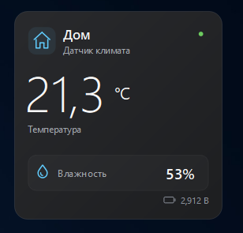

# Виджет Xiaomi LYWSD03MMC для Windows

Температура, влажность и напряжение батарейки на рабочем столе.
Тёмная карточка с перетаскиванием и изменением размера — не расширение панели
Windows «Виджеты».



Нужны **Windows 10/11, Python и Bluetooth Low Energy**. Виджет работает со
штатной BLE-прошивкой (совместимость зависит от её версии), не перепрошивает
датчик и не использует облако Xiaomi.

## Запуск

1. Запустите `install.cmd` — он создаст `.venv` и установит зависимости.
2. Откройте `start_widget.cmd` — виджет запустится без окна консоли.
3. Закройте Mi Home и не запускайте `sensor.py` одновременно с виджетом.
   Поиск датчика и подключение могут занять до минуты.

Проверка внешнего вида без датчика:

```powershell
.\.venv\Scripts\python.exe widget.py --demo
```

## Управление

- **Левая кнопка** — перетаскивание; края и углы — изменение размера.
- **Правая кнопка** — настройки, переподключение и закрытие.
- В настройках задаются название, Bluetooth-адрес и режим чтения.
  Пустой адрес включает поиск; адрес подключённого датчика запоминается.
- По умолчанию показания обновляются каждые **5 минут**, между чтениями связь
  закрыта. Можно выбрать интервал 5–60 минут или постоянную связь с запросом
  экономии энергии; конкретный срок работы батарейки не гарантируется.
- Положение, размер и настройки сохраняются. Статус и возраст показаний
  доступны при наведении. При потере связи остаются последние значения,
  устаревшие показания приглушаются.

## Если нет данных

Проверьте Bluetooth, батарейку, расстояние и подключения других приложений.
Сопряжение в Windows не гарантирует чтение показаний. Подробности ошибок:
`%LOCALAPPDATA%\MiTemperatureSensor\widget.log` (содержит адрес датчика).

Компьютер не должен спать. История температуры и влажности не ведётся;
напряжение батарейки сохраняется в
`%LOCALAPPDATA%\MiTemperatureSensor\battery.csv` не чаще раза в час на датчик.

## Автозапуск

Нажмите **Win+R**, введите `shell:startup` и добавьте туда ярлык на
`start_widget.cmd`.

## Проверки

```powershell
.\.venv\Scripts\python.exe -m unittest discover -s tests -v
```
